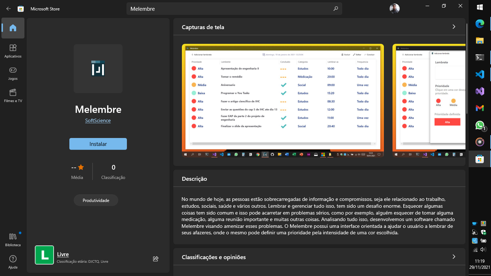
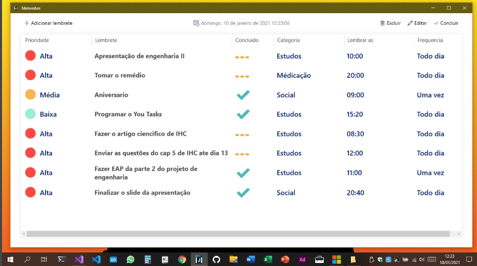
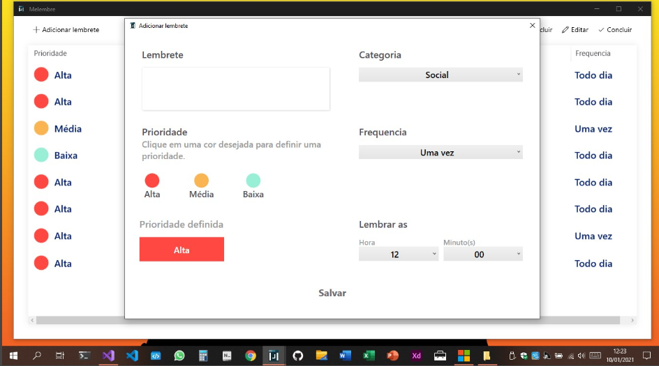

<h1>Melembre</h1>

No mundo de hoje, as pessoas estão sobrecarregadas de informação e compromissos, seja ele relacionado ao trabalho, estudos, sociais, saúde e vários outros. Lembrar e gerenciar tudo isso, tem sido um desafio enorme. Esquecer algumas coisas tem sido comum e isso pode acarretar em problemas sérios, como por exemplo, alguém esquecer de tomar alguma medicação, alguma reunião importante e muitas outras coisas. Analisando tudo isso, desenvolvemos um software chamado Melembre visando amenizar esses problemas. O Melembre possui uma interface orientada a ajudar o usuário a lembrar de seus afazeres, onde o mesmo pode definir uma prioridade pela intensidade de uma cor escolhida.

<h2>Baixe o melembre na microsoft store !</h2>
<a href="https://www.microsoft.com/store/productId/9NJZ7WJTBRVS">Clique aqui para baixar</a> 

<h2>Tecnologias utilizadas</h2>

O melembre foi feito utilizando O Windows Presentation Foundation (WPF), que é uma estrutura de interface do usuário que cria aplicativos cliente da área de trabalho. O WPF usa a linguagem XAML para fornecer um modelo declarativo para programação de aplicativos.

A linguagem de programação foi o <strong><em>C#<em><strong>

<h3>Capturas de tela</h3>
<figure>
  
  
</figure>
